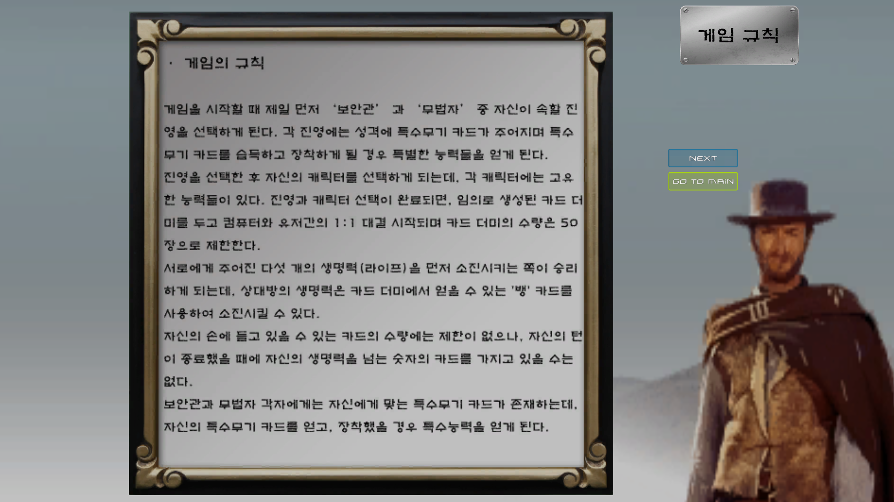
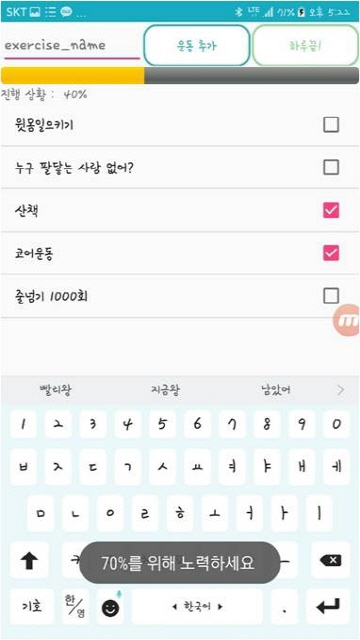

# MyPortfolioPHP
- 개발인원 : 1명
- 역할
  - 전체
## Introduction
직접 구현해 본 저의 포트폴리오 웹사이트입니다. (실제 운영을 위한 웹사이트는 아님)

HTML과 CSS로 레이아웃을 구성하고 JavaScript와 jQuery를 이용해 기능을 구현한 후, php를 이용해 MySQL과 연동하여 회원가입 및 로그인 세션 유지 기능을 구현하였습니다.

서버와 php, 데이터베이스는 모두 MAMP 로 통합설치하였으며, 데이터베이스 관리는 phpMyAdmin 으로 하였습니다.
- 개발인원 : 1명
- 역할
  - 전체
## Development Environment
MAMP 5.0.5
## Screenshots


## Code Preview
***JavaScript를 이용한 innerHTML 전환***
```html
<li class="aside-listText"><p><a href="javascript:workChange(1);">역할 카드게임 'WANTED'</a></p></li>
<li class="aside-listText"><p><a href="javascript:workChange(2);">GPS를 활용한 운동관리 어플리케이션</a></p></li>
```
```javascript
// 선택한 작품에 맞는 작품 설명 페이지 호출 함수
function workChange(idx) {
    var strHTML = "";
    var activitySection = document.getElementById("work-section");

    switch (idx) 
    {
    	// WANTED
    	case 1:
    	strHTML += "<h2>Unity엔진과 C#으로 구현한 카드배틀게임</h2>";
    	strHTML += "";
    	strHTML += "";
    	...
    	activitySection.innerHTML = strHTML;
    	break;
		
    	// 운동관리
    	case 2:
    	strHTML += "<h2>GPS를 활용한 종합 운동관리 안드로이드 앱</h2>";
    	strHTML += "&nbsp";
    	strHTML += "<br>";
    	...
    	activitySection.innerHTML = strHTML;
    	break;
    	...
 ```
 
***php session을 이용한 로그인 관리***
```php
<?php
session_start(); //세션변수 사용전에 session_start()를 사용해야 한다.

if(!isset($_SESSION['login_id']) && !isset($_SESSION['login_pw'])) { ?>
// 현재 세션 연결이 되어 있지 않은 상태라면 = id, pw 입력 테이블 보여줌.
<!-- ReadMe 파일 들여쓰기 문제로 임의 주석 처리. 실제 코드는 주석 처리 하지 않음.
<form action="./account/login_ok.php" method="post">				
	<table style='display: inline-block;''>
	... 
-->
<?php } else { // 현재 세션 연결이 되어 있는 상태라면(로그인 된 상태)
	$user_id = $_SESSION['login_id'];
	$user_nick = $_SESSION['login_nick'];
	echo "<p><strong>$user_nick</strong>($user_id) 님 로그인 되셨습니다.";
	echo " <a href=\"./account/logout.php\">[로그아웃]</p>";
}
?>
```
